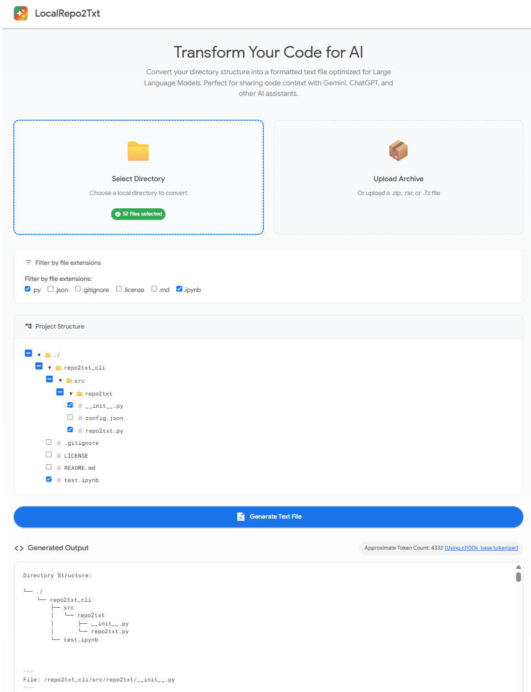

# Local Directory to Text for LLM

This web-based tool converts local directory contents into a formatted text file for LLM prompts. 

Forked from [repo2txt](https://github.com/abinthomasonline/repo2txt) with focus on local directory processing.

## Features

- **Local Directory Support**: Select and process local directories directly in your browser
- **File Selection**: Choose specific files/directories to include in the output
- **Extension Filtering**: Filter files by extension with convenient checkboxes
- **Jupyter Notebook Support**: Displays `.ipynb` files as formatted code and markdown blocks instead of raw JSON
- **Formatted Output**: Generate clean, structured text files perfect for LLM prompts
- **Browser-based**: Runs entirely in the browser for privacy and security - no server-side processing

## Usage

1. CMD: cd to your repo
2. Run `python -m http.server 8000`
3. Open `http://localhost:8000/local.html`
4. Enjoy the website

## Privacy & Security

This tool runs entirely in your browser. No files are uploaded to any server, ensuring complete privacy and security of your code and data.

## License

This project is open source and available under the [MIT License](LICENSE).

## Credits

- Original project: [repo2txt](https://github.com/abinthomasonline/repo2txt) by [Abin Thomas](https://github.com/abinthomasonline)